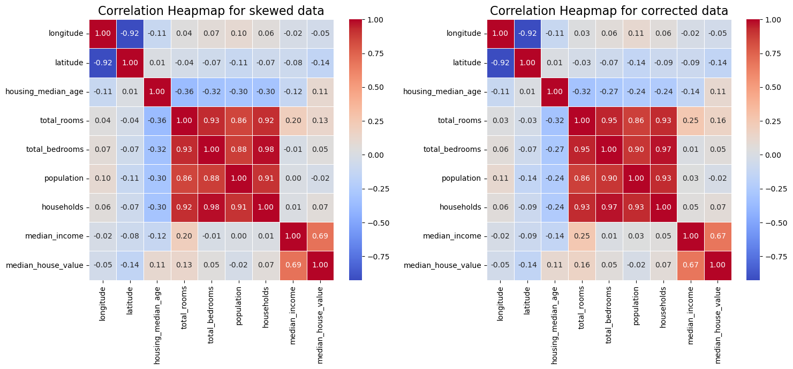
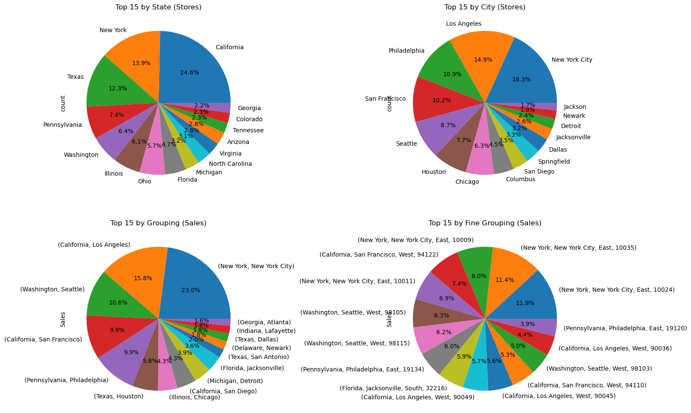

# Kaggle Data Analysis & Prediction

This directory focuses on **Exploratory Data Analysis (EDA)** and **predictive modeling** using real-world datasets from Kaggle! Each project contains advanced analytical techniques, extensive feature engineering, and cutting-edge machine learning approaches designed to maximize prediction accuracy.

---

## 🏠 [California Housing Prices Dataset](cali-house-prices/housing.ipynb)

This dataset provides detailed insights into housing market dynamics across California. Through sophisticated EDA and predictive modeling, we uncover complex relationships between various features (location, property attributes, economic indicators) and housing prices.

### Key Components:

- **Project Focus:** Building highly accurate prediction models that adhere to specific competition constraints.

- **Advanced Feature Engineering:** Creation of polynomial features, interaction terms, and transformation of raw data for better model performance.

- **Data Reduction Techniques:** Principal Component Analysis (PCA), dimensionality reduction methods to handle multicollinearity.

- **Statistical Modeling:** Bayesian regression approaches alongside traditional machine learning techniques.

- **Learning Outcomes:**
    * Mastering advanced EDA principles including correlation matrix analysis, statistical significance testing, and data visualization
    * Understanding feature engineering for regression problems (polynomial features, interaction terms)
    * Implementing complex model ensembling and stacking techniques for improved accuracy
    * Learning how to optimize models using cross-validation and hyperparameter tuning

---

## 💼 [Superstore Sales Dataset](superstore-sales/superstore.ipynb)
This retail performance dataset offers an in-depth view of sales dynamics across multiple dimensions, designed for exploratory analysis essential in real-life scenarios and identify key business drivers.

### Key Components:

- **Exploratory Analysis:** Comprehensive investigation using key indicators from all relevant business segments (Customer Analysis, Shipping Analysis, Geographical Analysis, Product Analysis, Sales Analysis) to understand current performance and identify trends.

- **Time Series Methods:** Implementation of statistical decomposition techniques including seasonal analysis and trend identification through methods like rolling window statistics or moving averages.

- **Project Focus:**
The primary goal is developing a thorough understanding of retail operations by analyzing sales data across customer segments, regions, products, and shipping performance. This exploration provides insights crucial for targeted business strategies.

- **Learning Outcomes:**
    * Advanced feature engineering tailored for sequential sales prediction.
    * Statistical mastery of ARIMA/SARIMA decomposition and modeling approaches.
    * Deep learning proficiency with LSTMs/GRUs applied to real-world retail forecasting.
    * Comprehensive model evaluation using metrics like MAE, RMSE, and MAPE.

**Note:** The dataset includes customer segmentation information (e.g., 'Segment' column) which is crucial for analyzing distinct purchasing behaviors.

---

## ⚡ Kaggle Playground Datasets
This collection includes comprehensive EDA and advanced modeling for all datasets from the Kaggle's 5th season of ML Challenges. Each notebook demonstrates sophisticated approaches to feature engineering while adhering strictly to competition constraints.

### Key Components:
- **Competition-Specific Optimization:** Techniques tailored to each challenge's unique evaluation criteria.

- **Advanced Algorithm Selection:** Random Forests, Gradient Boosting Machines (XGBoost, LightGBM), Neural Networks.

- **Project Focus:** Applying rigorous EDA principles and advanced ML techniques across multiple domains.

- **Learning Outcomes:**
    * Understanding how to adapt feature engineering strategies for different competition requirements.
    * Mastering the art of model selection based on specific evaluation criteria (not just accuracy).
    * Learning optimization techniques that maximize performance under constraints.

---

## 📝 Advanced Analysis Approach

All projects follow a structured methodology:

1. **Data Profiling & Cleaning:** Comprehensive analysis using pandas profiling and automated outlier detection.

2. **EDA & Feature Engineering:** In-depth exploration and transformation of data to enhance predictive.

3. **Model Selection & Optimization:** Choosing the most appropriate models based on evaluation criteria, and optimizing their hyperparameters.