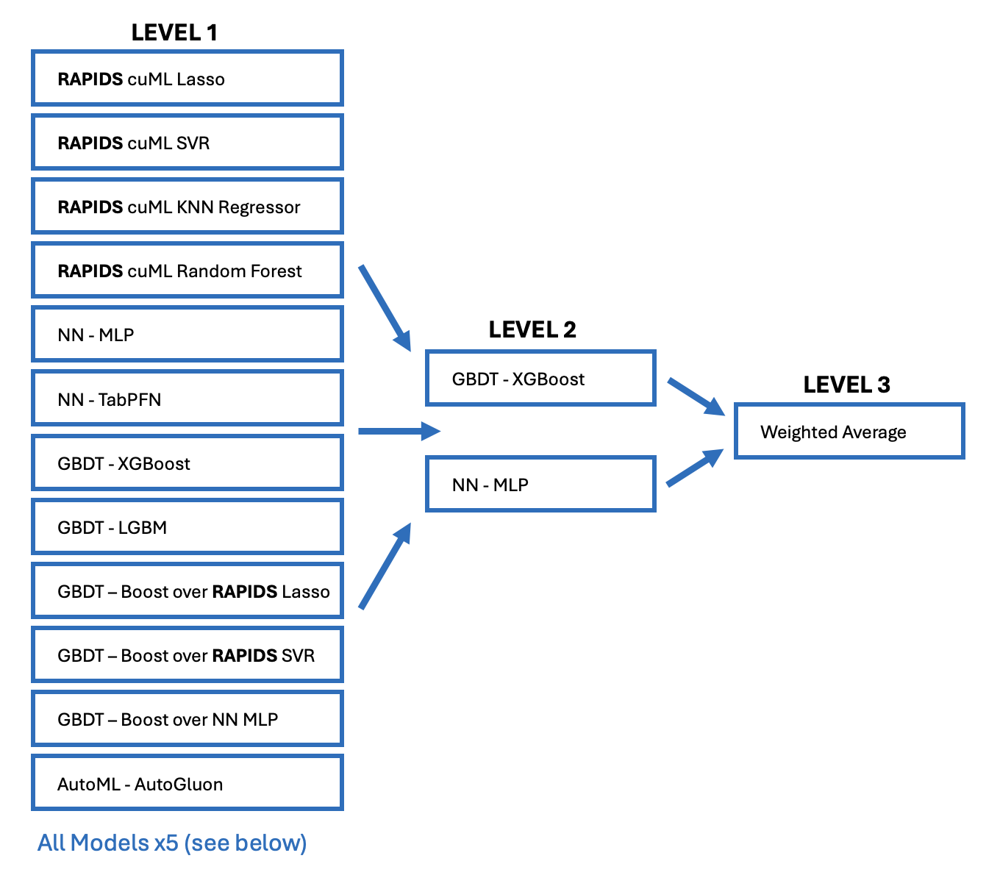

Kaggle Playground
===

# Index

- Season 5
    1. [Stickers]()
    2. [Backpacks]()
    3. [Rainfall]()
    4. [Podcast](#s05-e04)
    7. [Personality](#s05-e07)


# S05 E04

## * Feature Interaction

- The phenomenon where the combined effect of two or more features is different from the sum of their individual effects. In simpler terms, it means that the relationship between features isn't just additive; they *influence each other*.
- Instead of treating features as independent variables, feature interaction recognizes that their combined presence can *create new, more informative signals* that improve predictive power.
- Interactions can sometimes *compensate* for missing information in individual features.

### -> EXAMPLES

- **Age and Income**: The effect of age on spending might be different depending on income level. Younger people with high incomes might spend more on experiences, while older people with high incomes might prioritize savings.
- **Advertising Spend and Seasonality**: The impact of advertising spend on sales might vary depending on the time of year. Advertising might be more effective during holiday seasons.
- **Price and Quantity**: The total revenue generated from selling a product is a product of both its price and the quantity sold. A small change in price can have a disproportionate impact on revenue depending on the quantity.
- **Medical Diagnosis**: The interaction between symptoms and test results can be crucial for accurate diagnosis. A specific combination of symptoms and a particular test result might strongly indicate a certain disease.
- **Customer Segmentation**: The combination of demographics (age, location) and purchase history can create distinct customer segments with unique needs and preferences.

### -> IMPLEMENTATION

1. Explicit Interaction Terms: 
    - Polynomial Features
    - Cross Products
    
2. Non-linear Models: 
    - Decision Trees and Random Forests (Nodes are split based on combinations of features)
    - Gradient Boosting Machines (GBM)
    - Neural Networks
        
3. Feature Engineering Techniques: 
    - **Ratio Features**: Create new features by dividing one feature by another (e.g., price / quantity).
    - **Thresholding**: Create binary features based on thresholds of existing features (e.g., is_high_income = (income > threshold)).

4. Specialized Algorithms: 
    - **DeepFM**:  A neural network architecture specifically designed to model both low-order and high-order feature interactions.
    - **SHAP (SHapley Additive exPlanations)**:  A game-theoretic approach to explain the output of any machine learning model by calculating the contribution of each feature.  SHAP values can be used to identify important feature interactions.

### -> CHALLENGES

- Increased Dimensionality
- Interpretability
- Computational Cost
- Data Requirements

### -> Direct Relationship

- Features with strong direct relationship with target. These features caused users to watch a larger or smaller percentage of `Episode_Length_minutes`.
- We saw that the strongest direct relationship features are `Number_of_Ads`, `Episode_Sentiment`, and `Genre`.

### -> Indirect Relationship

- Below are each categorical feature's relationship with `Episode_Length_minutes`.
- If a feature causes `Episode_Length_minutes` to be longer or shorter, then **indirectly** that feature will cause the target `Listening_Time_minutes` to be larger or shorter! (even if it doesn't cause users to watch a different percentage of `Episode_Length_minutes`).
- We see that the strongest indirect relationship features are `Podcast_Name` and `Episode_Title`! 


## * Feature Selection

Because the **chi-squared test** only tells us the degree of drift from the expected frequenices, *not* whether the pair is more or less common, we can add a **Relationship** column to the *p_values table*. `Attractive` means that the parent split makes the child split more frequent, and `Repulsive` means the opposite. An `Attractive` relationship suggests the child split is *more* predictive once a contraint is placed on the parent feature; this makes it a great resource for finding features to engineer. A `Repulsive` relationship tells us there is redundancy. This is important for feature selection.

### -> Background & Justification

- Ordinary metrics like *correlation* are pretty limited when it comes to identifying feature relationships. A much better metric is something like **mutual information**, but it relies on distribution approximations. Plus, it's *more reliable* for binary relationships, like I(X, Y) or I(X1, X2).

- The reason **MI** is so powerful, especially for something like tabular data, is that it is *invariant* to monotonic transformations of the variables. Unlike correlation, it doesn't need its variables to be linearly related. Decision trees exhibit this same property. This, I believe, is the reason for the *empirical superiority* of decision trees in tabular prediction.

- For categorical data, we don't need complex distribution approximations; we can simply get the frequency counts. The chi-squared test is a well-understood empirical method for addressing the question of two categorical features being related. Indeed, it answers the same question as **MI**: how far does the empirical, 2D-distribution drift from the assumption of independence? Chi-squared tests allow us to easily convert these results into a probability, or p-value.


### -> Feature Enginnering

Feature engineering is an art. We might start with some visualizations, intuitive experiments, domain knowledge, statistics, etc. to help us navigate the endless combinations. But the curse of dimensionality remains with us always. This motivates a strategic approach that:

1. Identifies strong feature relationships,
2. Promises performance improvements.

The method described in this notebook for achieving these ends can be summarized as follows:

1. Train a gradient-boosted decision trees model on the data.
2. Traverse the trees, recording every time a split is a direct or indirect descendant of another.
3. Go through the pairs, recording how often each feature is a parent or child.
4. Estimate the expected pair frequency of (p, c) given empirical parent and child counts for p and c, respectively.
5. Perform a chi-squared test with the observed (p, c) counts.
6. Convert to p-values and start feature engineering.

Note that even with both numerical and categorical columns, we're looking only at the feature relationships via the split structure of the trees.

When a split is a descendant of another, the incoming data is filtered by the earlier split. So, when the probability of a split becomes more likely given another (informed by chi-squared), we know that there is mutual information. More importantly, we know that this mutual information is relevant for predicting Y. In mathematical terms, we're finding those parent-child pairs such that 
> `I(X_child ; Y | X_parent) ≥ I(X_child ; Y)`

These are the pairs that promise us the most performance improvement when combined effectively. To be clear, there's still work to be done, but knowing which pairs to investigate closely yields a massive speed-up. In some cases, we can identify opportunities we might not have tried otherwise.


## * Target Encoding

- Target encoding works best for high cardinality categorical columns.

    - If we have 3 category columns and each has cardinality 10. If we combine these 3 columns into a new columns with `df['new'] = df[col1].astype("str")+"_"+df[col2].astype("str")+"_"+df[col3].astype("str")`, then the resultant `new` column has cardinality `1000 = 10 x 10 x 10`. Then as a high cardinality column, it will perform well with TE.

- TE versus LE is usually the same when cardinality is around 10 or under. But when cardinality is around 100 or 1000 or more, then TE will perform better than LE. This is of course if the column has signal in it.

- Consider both categorical and numerical columns as candidates for [HIGH_CARDINALITY](#te-multiple-encodings).

- A common trick in tabular data is to target encode numerical columns too if the cardinality is less than number of `rows / 100` which is the case in this playground competition. (i.e. *each unique numerical value has on average 100+ observations*)

- We need to be careful when combining columns. Imagine `COL1` has values `1,2,3` and `COL2` has values `4,5,6`. If you just add the two columns `df['NEW'] = df['COL1'] + df['COL2']` then multiple combinations go to the same result.

- For example COL1=1 and COL2=5 results in `NEW=6`. And also COL1=2 and COL2=4 results in `NEW=6`. However we want `NEW=6` to represent only one combination of previous columns. Therefore you need to create a math transformation that **sends each pairing to its own unique number**.


## * Solution

Possible Approaches
- Predict Target
- Predict Ratio (i.e., target / feature)
- Predict Residuals (i.e., target - feature)
- Predict missing feature values (if applicable)

Possible Models
- Single Model
- [Hill Climbing Ensemble (Linear)](#hill-climbing)
- [Stacking Ensemble (Non-linear)](#stacking)


Hill climbing (or ridge) ensemble generally works well. However in this competition, the dataset was so complicated that a deep stack was the best solution. The most important feature is Episode_Length_minutes. It contains **90%+** of the signal. But it is missing for **11.6%** of the data! This means there are two scenarios;
- Predict target Listening_Time_minutes with `Episode_Length_minutes`
- Predict Listening_Time_minutes without `Episode_Length_minutes`

Hill climbing (and ridge) *cannot* do this (because it uses a linear level 2 model). Imagine that we make one model that does great predicting target with `ELM` and we build a second model that does great predicting target without `ELM`. Hill climbing will just take a *weighted average of all predictions*.

But a stack (non-linear level 2 model) will use predictions from one model when predicting with `ELM` and use the predictions from another model when predicting without `ELM`. In other words, instead of taking all predictions from all models, it will take *the best predictions from each model* (for different situations)!

### -> RAPIDS cuML Stack - 3 Levels of Models!


The secret to building a strong stack is diverse models. (And every model trains with the **same** 5 KFolds and we **must** remove all leaks from target encoding, pseudo labeling, etc). Diversity comes from different feature engineering and different models (and/or model hyperparameters).

For each new model built, engineere different sets of features. Each model has different customized features that benefit the new model best.


### -> Diversity x5

To add diversity to our stack we can take each of the 12 model depicted above and train it in at least 5 different ways described below. Additionally, we can change feature engineering and/or hyperparameters and train more ways. The final stack used 75 models. So approximately created each of the above 12 models in 6 different ways!

1. **Different Sets of Feature Engineering**

    The typical way to predict `Listening_Time_minutes` is to train a model using KFold and all columns of `train.csv`. Additionally we can create more columns with feature engineering. We can build multiple GBDT models each using different engineered features. This provides diversity to our stack. Also we can change GBDT hyperparameters. For example, some times we use `max_depth=10` and sometimes we use `max_depth=0`, `max_leaves=1024`. These find different interactions and create diverse models. Furthermore, sometimes we can use `max_depth=20` to get more interaction and sometimes `max_depth=5` for less interaction.

2. **Remove Episode_Length_minutes from All Rows!**

    The feature/column `Episode_Length_minutes` is important. We can remove `Episode_Length_minutes` from all rows and train a model to predict `Listening_Time_minutes` from all other columns. These models will be strong predicting target when `Episode_Length_minutes` is missing. And the stack will use these models when appropriate.

3. **Predict Ratio of Target divided by Episode_Length_minutes**

    For each model, we can create a new target with `train['new_target'] = train.Listening_Time_minutes / train.Episode_Length_minutes`. We can train models to predict this new target. We can then multiply this prediction by `Episode_Length_minutes` or an imputed value of `Episode_Length_minutes` from below.

4. **Predict Episode_Length_minutes (use Train.csv and Test.csv)**

    We can train models to predict `Episode_Length_minutes`. Futhermore, we can use both train.csv and test.csv data to train and predict `Episode_Length_minutes`. Because both train.csv and test.csv have all the columns necessary.

    Afterwards, we can use these ELM predictions in at least 3 ways.
    - We can impute missing values with these ELM preds then train a model.
    - We can replace every row's ELM (both missing and non-missing) with these ELM preds, then train a model.
    - We can multiply these ELM preds by the Ratio preds (from above) to predict the target `Listening_Time_minutes`. 

    All 3 of these ideas will make new diverse models!

5. **Pseudo Label (use Train.csv and Test.csv)**

    We see that many columns are important. We can use more information from more columns by using the columns from test.csv. We can add test.csv data with pseudo labels to the training of all our models.


## * Appendix

### -> TE: Multiple Encodings

Multiple encodings are useful for high cardinality categorical columns. The idea is this: GBDT only see an ordered list of numbers. Then GBDT are made of decision trees which make splits like `X<SPLIT` go to left node and `X>=SPLIT` go to right node. When we take an existing Label Encoded column of cardinality 1000, then the column consists of the numbers 1 thru 1000. The decision tree must split these numbers up.

Now imagine that we add a new column with a new encoding. This is just a mapping changing the numbers. Maybe all the previous 1 become 32. All the previous 2 become 67. All the previous 3 become 345. The new column also has the numbers 1 thru 1000 but they are assigned differently. This allows the decision tree to be able to split the column in new ways.

When cardinality is very high like 1_000, 10_000, 100_000 the decision tree struggle to split the numbers up. Maybe the decision tree wants to send numbers 245, 3402, 1108, 444, 2003, to the left. But it cannot easily. It will need to make many splits to extract these numbers. Now imagine that we reassign those 5 numbers to 1,2,3,4,5. Now the model can get everything it wants with one split namely X<6.

(You may be thinking that Target Encoded columns are not the numbers 1 thru 1000 but rather float32 like 40.3, 40.7. But that doesn't matter for decision trees. Since decision trees make splits every list of numbers is just the ordering. We can rename them 1 thru 1000 and it appears exactly the same to the decision tree).


### -> Hill Climbing

Focuses on combining linear models. It iteratively builds an ensemble by adding new linear models that improve the overall performance.  It's essentially a form of sequential model building.

Suitable when you have a good understanding of the problem and believe that linear models are sufficient.  It's a good starting point for simple problems.

```python
ensemble = []  # Initialize the ensemble as an empty list

# Ininitialize the ensemble with a single model
initial_model = LinearRegression()
initial_model.fit(X, y)
ensemble.append(initial_model)

for _ in range(10):  # Try a few new models in each iteration
    new_model = LinearRegression()
    new_model.fit(X, y)

    # Calculate the ensemble's prediction with the new model
    ensemble_predictions = np.array([model.predict(X) for model in ensemble])
    ensemble_predictions = np.mean(ensemble_predictions, axis=0) # Average predictions

    # Evaluate the new model's contribution to the ensemble
    new_ensemble_predictions = np.array([model.predict(X) for model in ensemble + [new_model]])
    new_ensemble_predictions = np.mean(new_ensemble_predictions, axis=0)

    if best_new_score < best_score:
        ensemble.append(best_new_model)

ensemble_predictions = np.array([model.predict(X_test) for model in ensemble])
ensemble_predictions = np.mean(ensemble_predictions, axis=0)
mse = mean_squared_error(y_test, ensemble_predictions)
```

### -> Stacking

Leverages the strengths of different base learners. It combines multiple diverse models using a "meta-learner" to learn how to best weight or combine the predictions of the base learners.  It's a two-stage process.

Suitable when you have access to diverse models and want to leverage their strengths.  It's a good choice for complex problems where linear models are not sufficient.  Requires more experimentation and tuning.

```python
# Base learners
base_learners = [
    LogisticRegression(),
    DecisionTreeClassifier(),
    SVC(kernel='linear')
]

# Meta-learner
meta_learner = LogisticRegression()

# Stacking ensemble
stacking_ensemble = StackingClassifier(estimators=base_learners, final_estimator=meta_learner)

# Train the stacking ensemble
stacking_ensemble.fit(X_train, y_train)
```

### -> Tips

- The way to tell if your model is learning or not is to compare your model to predicting just the mean. So, use the mean of `Episode_Length_minutes` as a prediction for all rows and compute the RMSE from that. That is the baseline. Then see if your model does better than that. If it does better than that, then your model is learning.

- To evaluate a new set of feature, build each model individually. So for *linear regression*, build one set of features (mainly OHE and products of OHE). For *GBDT*, build another set of features (lots of group by aggregation stuff), etc. Then add a few dozen at a time and evaluate CV score. If CV **improves**, keep the dozen, otherwise discard them.

- The easiest way to make strong NN features is just take all the features from our strongest GBDT. Then we One Hot Encode all the categoricals and normalize (subtract mean divide std) all the numericals. Then finally impute missing to zero. (We could alternatively make embeddings but the following is the easiest way to get another quick NN for stack).
    ```python
    # Preprocess to convert GBDT Features to NN Features
    print("Normalizing...", end='')
    norm_cols = [c for c in X_train.columns if c not in CATS ]
    means = X_train[norm_cols].mean()
    stds = X_train[norm_cols].std()
    stds = stds.replace(0, 1)
    X_train[norm_cols] = (X_train[norm_cols] - means) / stds
    X_valid[norm_cols] = (X_valid[norm_cols] - means) / stds
    X_test[norm_cols] = (X_test[norm_cols] - means) / stds
    print("done")

    print('Before:',X_train.shape, X_valid.shape, X_test.shape)
    combined = pd.concat([X_train,X_valid,X_test],axis=0)
    combined = pd.get_dummies(combined, columns=CATS )
    X_train = combined.iloc[:len(X_train)]
    X_valid = combined.iloc[len(X_train):len(X_train)+len(X_valid)]
    X_test = combined.iloc[len(X_train)+len(X_valid):]
    print('After:',X_train.shape, X_valid.shape, X_test.shape)
    del combined

    print("Impute missing")
    X_train = X_train.fillna(0.0)   
    X_valid = X_valid.fillna(0.0)   
    X_test = X_test.fillna(0.0)   
    ```

    ```python
    # NN Architecture
    from tensorflow.keras.layers import BatchNormalization, Dropout
    from tensorflow.keras.layers import Activation

    def build_model(size=len(FEATURES)):
        x_in = Input(shape=(size,))
        x = Dense(512)(x_in)
        x = BatchNormalization()(x)
        x = Activation('relu')(x)
        x = Dropout(0.3)(x)

        x = Dense(256)(x)
        x = BatchNormalization()(x)
        x = Activation('relu')(x)
        x = Dropout(0.3)(x)

        x = Dense(128, activation='relu')(x)
        x = Dense(1, activation='linear')(x)

        model = Model(inputs=x_in, outputs=x)
        return model
    ```

- Ask LLMs for help, they (mostly) always offer suggestions that improve on the CV and LB score!


# S05 E07
