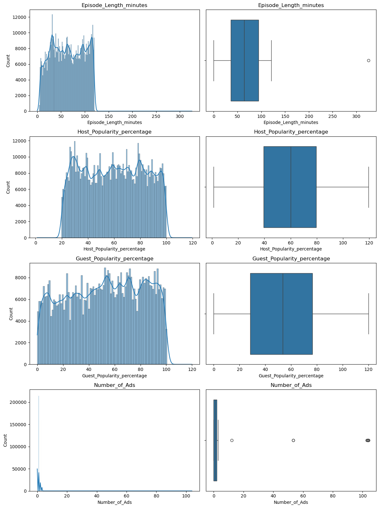
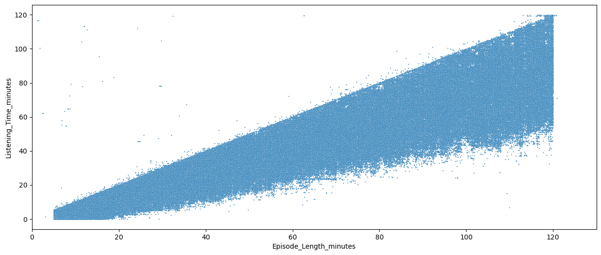
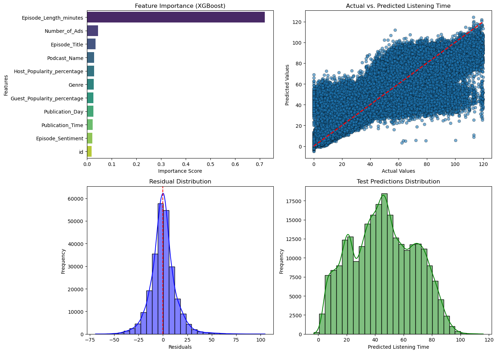
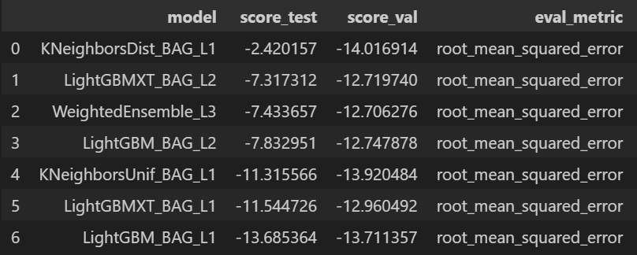

# 🎧 Podcast Listening Time Prediction 🎧

## 🚀 Introduction
This project focuses on developing a predictive model to accurately forecast the duration of podcast episodes based on their various attributes.

## 📊 Dataset Overview
The dataset used for this project comes from Kaggle's Podcast Listening Time Prediction competition. It contains information on over 50,000 podcast episodes, encompassing a wide array of attributes such as episode title, genre, host and guest popularity percentages, number of ads, publication day and time, and sentiment analysis.

## 🛠️ Feature Engineering
Feature engineering is a critical component of this project. We've engineered several features, including:

- 🌟 **Popularity Metrics:** `Host_Populariity_percentage` and `Guest_Populariity_percentage` to capture the influence of hosts and guests on episode length.
- 🗓️ **Temporal Features:** Categorization of `Publication_Day`, `Publication_Time`, and `Episode_Sentiment` into numerical variables to capture temporal patterns.
- 🔗 **Combinations & Encoding:** Creating new features by combining categorical variables like `Podcast_Name`, `Genre`, and `Publication_Day` using techniques like `LabelEncoder` and `TargetEncoder`.
- 📊 **Statistical Aggregation:**  Performing statistical aggregations on encoded columns to generate additional informative features.

## ⚙️ Modeling Process
This project explores a variety of modeling approaches:

- 🚀 **LightGBM:**  Utilizing a LightGBM model with target encoding to handle categorical variables effectively.
- 📈 **XGBoost:**  Employing an XGBoost model with feature importance analysis and hyperparameter tuning for optimal performance.

- 🤖 **AutoML:**  Leveraging AutoML through the `TabularPredictor` from the `autogluo` library for a comparative analysis against manually tuned models.

## 🏆 Results and Analysis
The results demonstrate that the **XGBoost model consistently outperforms** the other models, achieving a **low RMSE score**. This indicates strong predictive power for podcast listening time.

## 💡 Skills Utilized/Gained
This project has enabled the development and enhancement of the following skills:

* 🧹 **Data Preprocessing & Feature Engineering:** Handling missing values, transforming data, and creating meaningful features.
* ⚙️ **Hyperparameter Tuning:** Optimizing model performance through careful hyperparameter selection for both LightGBM and XGBoost.
* 🔍 **Feature Importance Analysis:** Understanding the impact of different features on the model's predictions using SHAP values.
* 🧪 **Model Comparison:**  Evaluating and comparing the performance of diverse modeling approaches.
* 🧠 **Tabular Data Understanding:** Gaining a deeper understanding of tabular data types and their implications in machine learning.