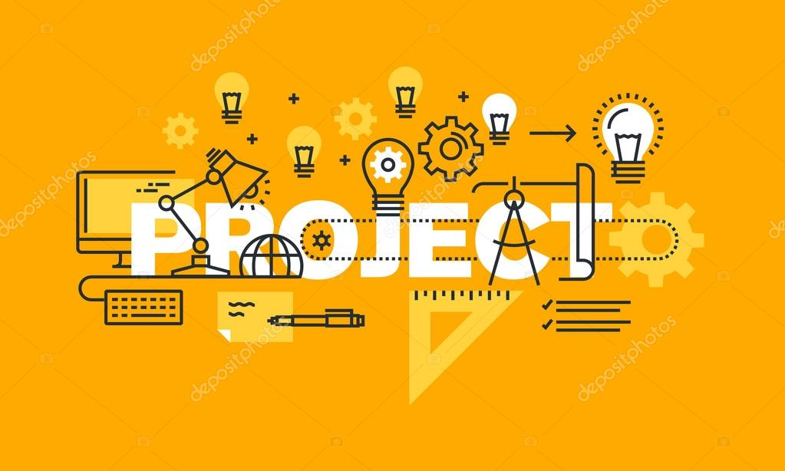

#  [Projects](./projects/README.md)

<!-- - [Deepseek-V3](https://github.com/Yash9988/self-learn/tree/main/projects/deepseek-v3/transformer.ipynb)

- [GPT-2](https://github.com/Yash9988/self-learn/tree/main/projects/gpt2/transformer.ipynb)

- [SigLIP Vision Transformer](https://github.com/Yash9988/self-learn/tree/main/projects/vision-transformer/transformer.ipynb)

- [PyTorch](https://github.com/Yash9988/self-learn/tree/main/projects/pytorch-practice/)

- [Power-BI Dashboards](https://github.com/Yash9988/self-learn/tree/main/projects/power-bi/)

- [PySpark](https://github.com/Yash9988/self-learn/tree/main/projects/pyspark/spark-tutorial.ipynb)

- [Django Web Applications](https://github.com/Yash9988/self-learn/tree/main/projects/django/) -->

# [Algorithm Implementation](./algo-imp/README.md)

# [Bit-Manipulation](./BM/README.md)

# [Dynamic Programming](./DP/README.md)

