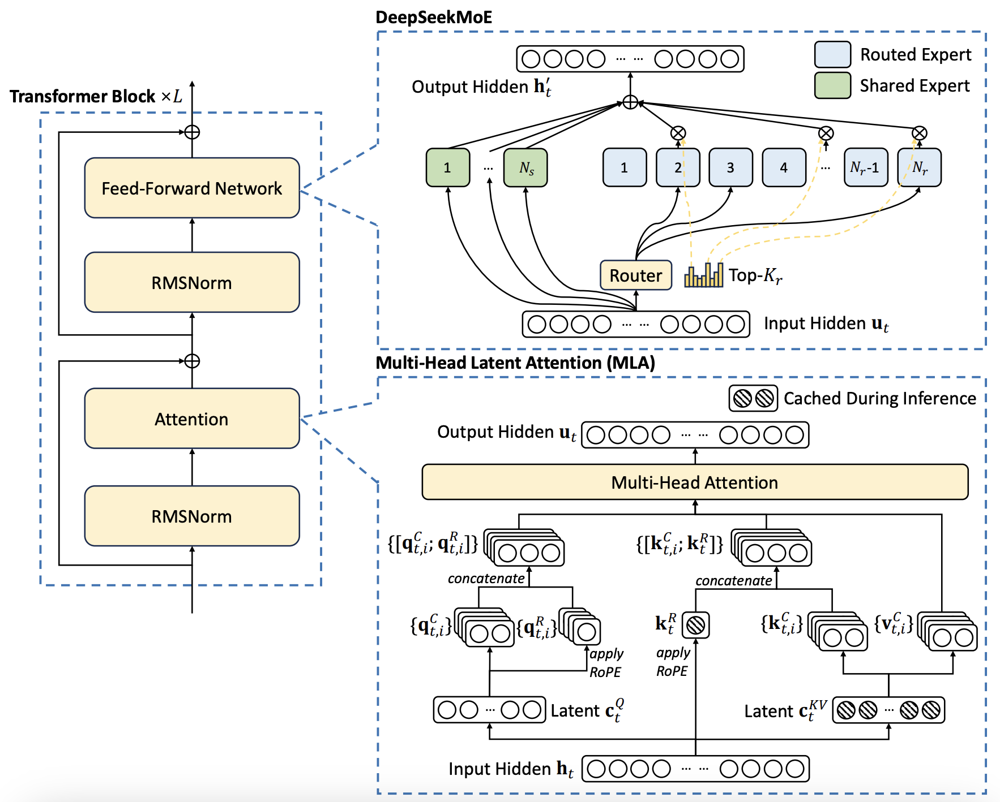
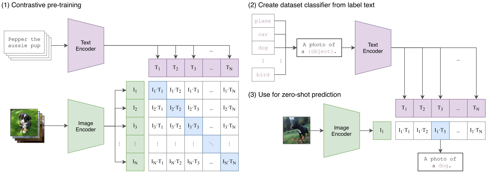
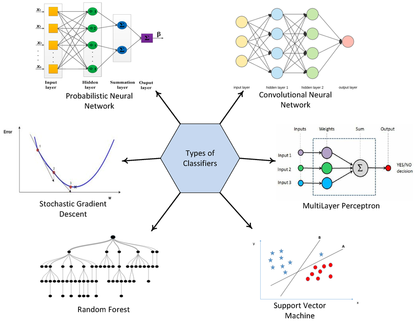
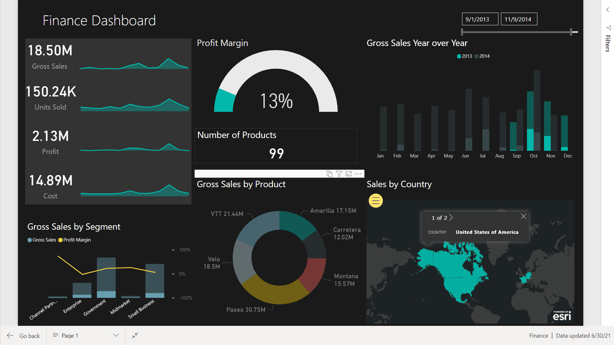
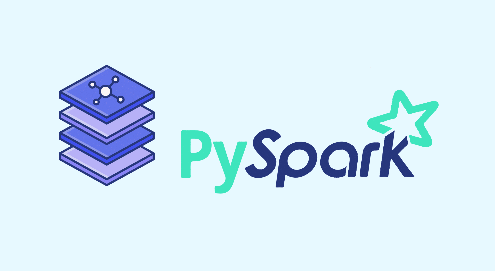
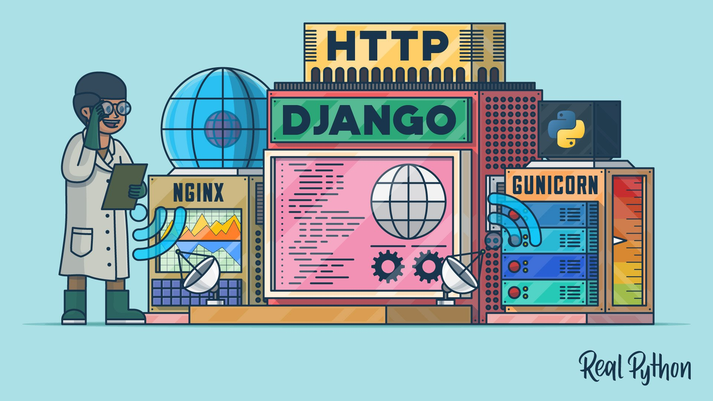

# Projects

## [Deepseek-V3](https://github.com/Yash9988/self-learn/tree/main/projects/deepseek-v3/transformer.ipynb)

* Implemented the Deepseek-V3 transformer model architecture from scratch using PyTorch.
* The model is designed to perform image classification tasks efficiently.

## [GPT-2](https://github.com/Yash9988/self-learn/tree/main/projects/gpt2/transformer.ipynb)

* Implemented the GPT-2 model architecture for text generation tasks from scratch.
* Trained the model on the "tiny-shakespeare" dataset, and then later on huggingface's [fineweb-edu](https://huggingface.co/datasets/HuggingFaceFW/fineweb-edu) dataset, achieving impressive results.

## [SigLIP Vision Transformer](https://github.com/Yash9988/self-learn/tree/main/projects/vision-transformer/transformer.ipynb)

Implementation of Vision Transformer for image classification, from scratch.

## [PyTorch](https://github.com/Yash9988/self-learn/tree/main/projects/pytorch-practice/)

Implmented and trained various classifiers using PyTorch, from scratch.

* [Binary Classifier](https://github.com/Yash9988/self-learn/tree/main/projects/pytorch-practice/binary_classifier.ipynb)

* [Image Classifier](https://github.com/Yash9988/self-learn/tree/main/projects/pytorch-practice/image_classifier.ipynb)

* [Image Classifier with Transfer Learning](https://github.com/Yash9988/self-learn/tree/main/projects/pytorch-practice/image_classifier_pretrained.ipynb)

* [Text Classifier](https://github.com/Yash9988/self-learn/tree/main/projects/pytorch-practice/text_classifier.ipynb)

* [Audio Classifier](https://github.com/Yash9988/self-learn/tree/main/projects/pytorch-practice/audio_classifier.ipynb)

## [Power-BI Dashboards](https://github.com/Yash9988/self-learn/tree/main/projects/power-bi/)

Power BI dashboards to visualize and analyze data from various sources.

* [Dummy Dashboard](https://github.com/Yash9988/self-learn/tree/main/projects/power-bi/power-bi/dummy-analysis/my-dummy-analysis.pbix)
    * A dummy dashboard created for practice and learning purposes.

* [Beginner Dashboard](https://github.com/Yash9988/self-learn/tree/main/projects/power-bi/power-bi/beginner-course/classic_model.pbix)
    * A beginner-level dashboard showcasing basic data analysis techniques.

## [PySpark](https://github.com/Yash9988/self-learn/tree/main/projects/pyspark/spark-tutorial.ipynb)

A beginner-level course on PySpark, covering the basics concepsts of data processing and analysis using Spark.

## [Django Web Applications](https://github.com/Yash9988/self-learn/tree/main/projects/django/)

Django Web Applications showcase a collection of web applications built with the Django framework.

* [First Project](https://github.com/Yash9988/self-learn/tree/main/projects/django/firstproject/)
    * Implemented and documented the development process for a simple django web application.
    * Used Django's built-in admin panel for managing the application's data.

* [Littlelemon Project](https://github.com/Yash9988/self-learn/tree/main/projects/django/littlelemon/)
    * Leveraging the learnings from the first project, developed a more complex web application for a restaurant website called Little Lemon.
    * Integrated Django's authentication system for user management.
    * Used Django REST framework for building APIs.