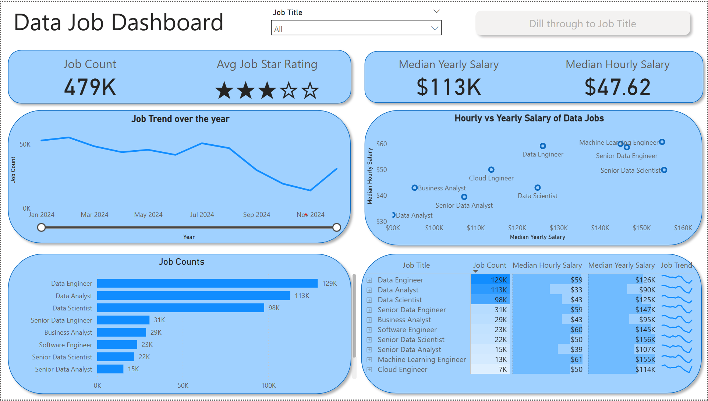
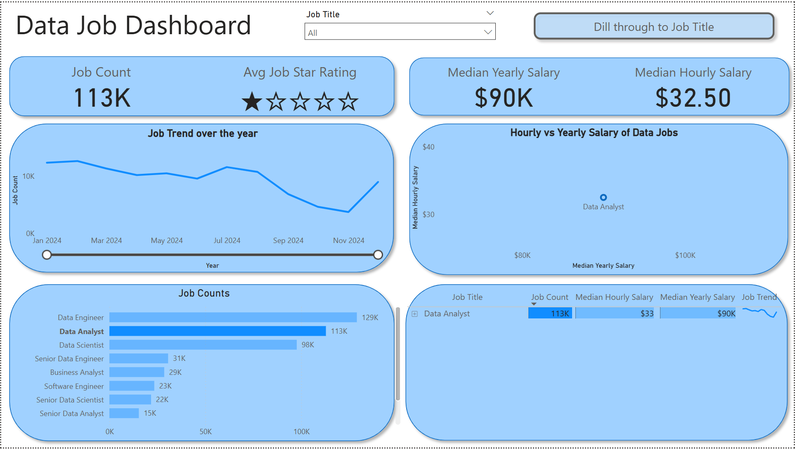
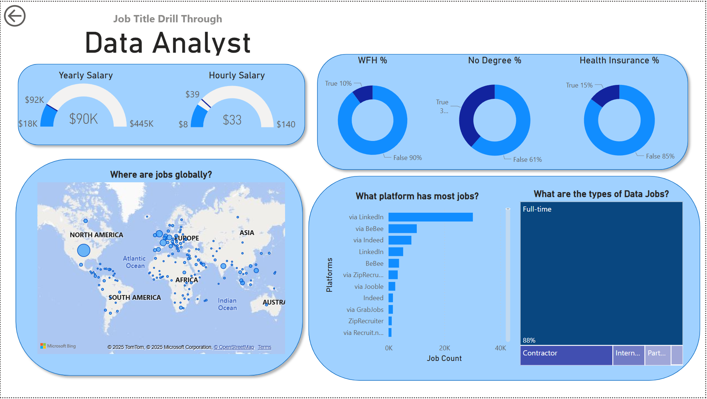

# 📊 Data Job Postings Dashboard Project

This project involves creating a Power BI dashboard visualizing data from job postings scraped from Google.
The data, originally collected since 2022 using a bot and supported by Serpapi, provides insights into job trends, 
salaries, required skills, and company information.

## Project Scope

The dashboard aims to provide a clear and interactive overview of the data-related job market. Key areas of focus include:

*   **Job Trends:** Analyzing the number of data analyst job postings over time.
*   **Salary Analysis:** Examining median yearly and hourly salaries for data analyst roles.
*   **Geographical Distribution:** Mapping the location of job postings globally.
*   **Skills Required:** Identifying the most frequently requested skills.
*   **Platform Analysis:** Understanding where these job postings are being advertised (e.g., LinkedIn, Indeed).
*   **Company Information:** Exploring the companies hiring data analysts.
*   **Job Types:** Understanding the distribution of full-time, contractor, intern, and part-time roles.

## Skills Showcased

The completion of this project and dashboard demonstrates proficiency in the following skills:

*   **Data Wrangling & Cleaning:** Handling and preparing data from various sources and formats.
*   **Data Visualization:** Creating insightful and visually appealing dashboards using Power BI.
*   **Data Analysis:** Identifying trends, patterns, and relationships within the data.
*   **Power BI Development:** Utilizing Power BI features for data modeling, calculations, and interactive visualizations.
*   **Star Schema Design:** Understanding and implementing star schema data models.
*   **SQL:** Used for querying and manipulating data (depending on how the data was accessed).
*   **Problem Solving:** Addressing challenges in data integration, visualization, and performance optimization.
*   **Communication:** Presenting data insights and dashboard functionality effectively.

---

